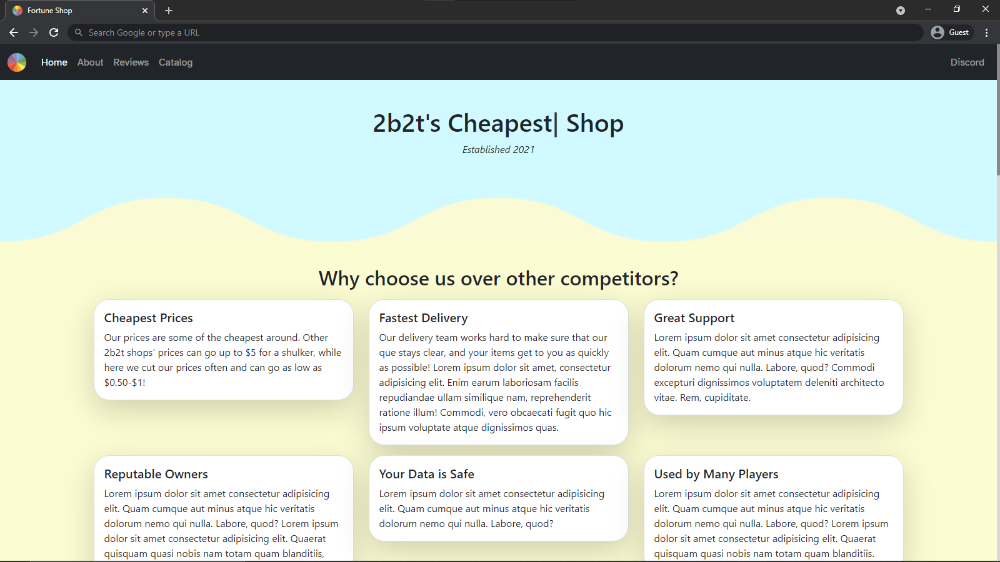

 

  

  <h3 align="center">Fortune Shop Website</h3>

  

    A website designed for the 2b2t shop "Fortune".
     
     
    <a href="https://github.com/JakeJeeperjinks/fortuneshop">View Demo</a>
    .
    <a href="https://github.com/JakeJeeperjinks/fortuneshop/issues">Report Bug</a>
    .
    <a href="https://github.com/JakeJeeperjinks/fortuneshop/issues">Request Feature</a>
  

   

## Table Of Contents

* [About the Project](#about-the-project)
* [Built With](#built-with)
* [Getting Started](#getting-started)
* [Roadmap](#roadmap)
* [Contributing](#contributing)
* [Authors](#authors)
* [Acknowledgements](#acknowledgements)

## About The Project

This is a website made for the shop on 2b2t known as Fortune. As of right now, it's just a catalog-type site with info about the shop. But hopefully, soon payments will be processed through the site, and all transactions/listings will occur on the site!

## Built With

This site was built using the following languages:

* [HTML](https://developer.mozilla.org/en-US/docs/Web/HTML)
* [CSS](https://developer.mozilla.org/en-US/docs/Web/CSS)
* [JS](https://developer.mozilla.org/en-US/docs/Web/javascript)

## Getting Started

It's really easy, all you do is click the green button that says "Clone", then click Download ZIP. After you download the zip, you'll wanna extract it to a folder, and once that's done you'll wanna open up the folder and double click on index.html. Once you've double-clicked on index.html, it should open the site up. (Of course, once it's hosted somewhere you won't wanna open it locally).

## Roadmap

See the [open issues](https://github.com/JakeJeeperjinks/fortuneshop/issues) for a list of proposed features (and known issues).

## Contributing

Contributions are what make the open source community such an amazing place to be learn, inspire, and create. Any contributions you make are **greatly appreciated**.
* If you have suggestions for adding or removing projects, feel free to [open an issue](https://github.com/JakeJeeperjinks/fortuneshop/issues/new) to discuss it, or directly create a pull request after you edit the *README.md* file with necessary changes.
* Please make sure you check your spelling and grammar.
* Create individual PR for each suggestion.
* Please also read through the [Code Of Conduct](https://github.com/JakeJeeperjinks/fortuneshop/blob/main/CODE_OF_CONDUCT.md) before posting your first idea as well.

### Creating A Pull Request

1. Fork the Project
2. Create your Feature Branch (`git checkout -b feature/AmazingFeature`)
3. Commit your Changes (`git commit -m 'Add some AmazingFeature'`)
4. Push to the Branch (`git push origin feature/AmazingFeature`)
5. Open a Pull Request

## Authors

* **Jake** - *Lead Web Developer* - [Jake](https://github.com/JakeJeeperjinks) - *Created and Designed Website*

